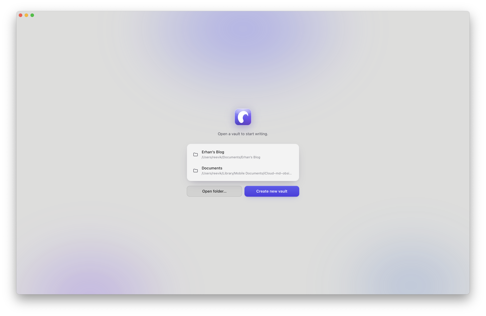
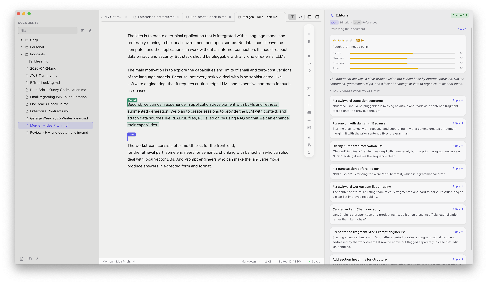

<p align="center">
  
</p>

<h1 align="center">Reevik Markdown Editor</h1>

<p align="center">
<b>A Markdown editor for macOS — Live preview embedded charts and diagrams, and a built-in Claude writing agent. (Claude Code required)</b>
</p>

<p align="center">
  
  
  
</p>

<table align="center">
  <tr>
    <td width="50%">
      
    </td>
    <td width="50%">
      
    </td>
  </tr>
</table>

---

## Features

### Vaults & files

- **Obsidian-style vaults** — a vault is just a folder of `.md` files on disk. No
  database, no lock-in; your notes stay plain Markdown you can edit anywhere.
- **Vault launcher** on startup: open any folder as a vault, create a new one, or
  pick from your recent vaults.
- **File tree** with live filtering, sorting and expand/collapse all.
- **Drag & drop** notes and folders to reorganise — open tabs follow the move.
- Create, rename and delete notes and folders inline.

### Editor

- **Live Preview** — Markdown renders as you write, and the raw syntax reveals
  itself only on the line you're editing. A source mode (`⌘/`) is a keystroke away.
- **Tabs** for multiple open notes, each with its own buffer, so unsaved edits
  survive tab switches.
- **Autosave** to disk, debounced per note.
- **Status bar** with file type, size, last-edited time and save state.
- **Typography settings** — pick the editor font and size; applies instantly.

### Rich content

- **Charts** — [Vega-Lite](https://vega.github.io/vega-lite/) specs in a
  ` ```vega-lite ` block become live charts, with drag-to-resize and alignment.
- **Diagrams** — [Mermaid](https://mermaid.js.org) blocks, including UML class,
  sequence, state and ER diagrams.
- **Math** — LaTeX via KaTeX, inline (`$…$`) and display (`$$…$$`).
- **Images** — drag, drop or paste straight into a note; resize and align them.
- **Code blocks** with syntax highlighting, plus tables, task lists and quotes.
- **YAML frontmatter** collapses into a tidy *Document Metadata* pill.
- **Content Index** — a ` ```content-index ` block renders a Confluence-style
  contents list of every note beside and below the current one. See below.

### Content Index

Drop this into a note:

````markdown
```content-index
```
````

and it renders as an ordinary bulleted Markdown list — one linked entry per note
in the note's own folder and everything under it, pages first, then each
sub-folder nested under its own bullet.

The block is **immutable**: it holds no text of its own, so there is nothing to
edit and nothing that can fall out of step with the vault. The list is read from
disk every time it draws, and it redraws whenever the hierarchy changes — a new
note, a rename, a move, a delete, or a note saving under a new `title:` —
including changes made outside the app, which it picks up when the window
regains focus.

Each entry is titled by the `title:` key in that note's YAML frontmatter, and by
its file name when it has none. Clicking one opens it in a tab. Folders holding
no Markdown are left out, as is the note hosting the index.

Add a number to cap how many folder levels appear — ` ```content-index|2 ` shows
this folder and one level below it.

`include-headers=N` pulls each note's own headings into the list, down to that
`#` level, each one linking straight to that spot in the note:

````markdown
```content-index|include-headers=2
```
````

lists every `#` and `##` in every note, indented by its `#` count under the page
it belongs to. Headings inside fenced code and in frontmatter are ignored, and
anchors use the usual GitHub slug (`## Rate Limiting` → `#rate-limiting`).

Clicking the block puts the cursor in it and swaps the rendered list for the
Markdown it stands for — the actual `- [Title](path.md)` lines, indented by
level. That view is **read-only**, as is the block itself: typing, pasting and
backspacing into it do nothing. Click anywhere else to go back to the list.

Its **settings** are the exception, and they have their own surface: hover the
block and a small bar appears top-right with **Depth** and **Headings**. Those
rewrite the fence for you — the only edit the block accepts. So the list and its
source stay immutable while the component itself stays configurable.

To remove a block, select the whole of it (or a range around it) and delete;
partial edits at its edges are rejected.

`⌘/` (Markdown source mode) is unaffected — it shows the file as it really is on
disk, which is the bare ` ```content-index ` fence.

### AI writing agent

Powered by Claude, through either the local **`claude` CLI** (no API key needed) or
your own **Anthropic API key**, stored in the macOS Keychain.

- **Editorial review** runs automatically when you open a note: a **quality score**
  (stars, percentage and per-dimension ratings for clarity, structure, grammar and
  tone), a one-line assessment, and a list of concrete edits.
- **Click-to-apply suggestions** — each is a self-contained original → replacement
  edit you accept individually. The agent proposes *local* changes only; it never
  rewrites your document wholesale.
- **Rephrase selection** (`⌘⇧R`) with Google-Docs-style collaboration markers.
- **Find references** (`⌘⇧F`) genuinely searches the web for papers, documentation
  and articles on your topic, then lists them with a summary and why each is
  relevant — open in your browser, or insert as Markdown citations.
- **Streaming results** appear progressively with a live elapsed timer, rather than
  after a long silence.
- **Model selection** — Opus 4.8, Sonnet 5, Haiku 4.5, or your backend's default.

### Writing tools

- **Command palette** (`⌘K`) — fuzzy search across every action, with shortcuts shown.
- **Floating insert toolbar** with 16 insert actions; drag it anywhere and it stays put.
- **Export as PDF** (`⌘P`) — charts, diagrams, math and images are pre-rendered into
  a clean printed article with proper page breaks.
- Three resizable, collapsible panes; your layout is remembered between launches.

## Keyboard shortcuts

| | |
|---|---|
| `⌘N` / `⌘⇧N` | New note / new folder |
| `⌘W` / `⌘⇧W` | Close tab / close window |
| `⌘P` | Export as PDF |
| `⌘K` / `⌘⇧P` | Command palette |
| `⌘/` | Toggle Markdown source |
| `⌘⌥1` `⌘⌥2` `⌘⌥3` | Toggle sidebar / AI panel / toolbar |
| `⌘⇧A` | Editorial review |
| `⌘⇧F` | Find references |
| `⌘⇧R` | Rephrase selection |
| `⌘⇧O` | Open vault |
| `⌘,` | Settings |
| `⌘B` `⌘I` `⌘E` `⌘⇧K` | Bold / italic / inline code / link |
| `⌘⇧X` `⌘⇧C` `⌘⇧L` `⌘⇧T` | Strikethrough / code block / list / checklist |

## Getting started

Download the latest artifact from releases and install it. Recent changes are in
the [changelog](CHANGELOG.md).

> The build is ad-hoc signed rather than notarised, so macOS warns on first launch — right-click → **Open**.

### Building from source

Requires [Rust](https://rustup.rs) and [Node.js](https://nodejs.org).

```sh
npm install
npm run tauri dev     # run in development
npm run tauri build   # produce a .app and .dmg
```

## Licence

Licensed under the Apache License, Version 2.0.

You may obtain a copy of the licence at
<http://www.apache.org/licenses/LICENSE-2.0>.

Unless required by applicable law or agreed to in writing, software distributed
under the Licence is distributed on an **"AS IS" BASIS, WITHOUT WARRANTIES OR
CONDITIONS OF ANY KIND**, either express or implied. See the Licence for the
specific language governing permissions and limitations under it.

© 2026 Erhan Bağdemir
